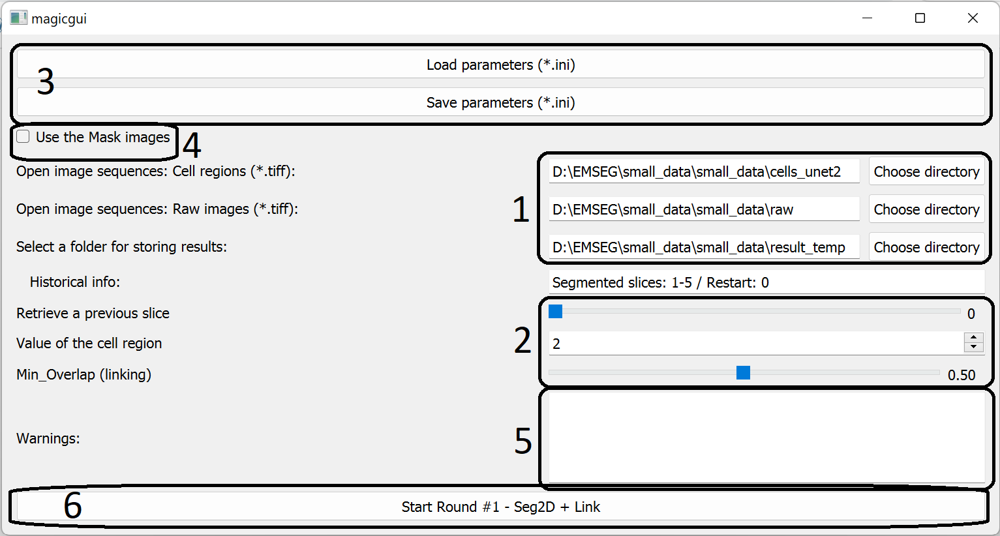
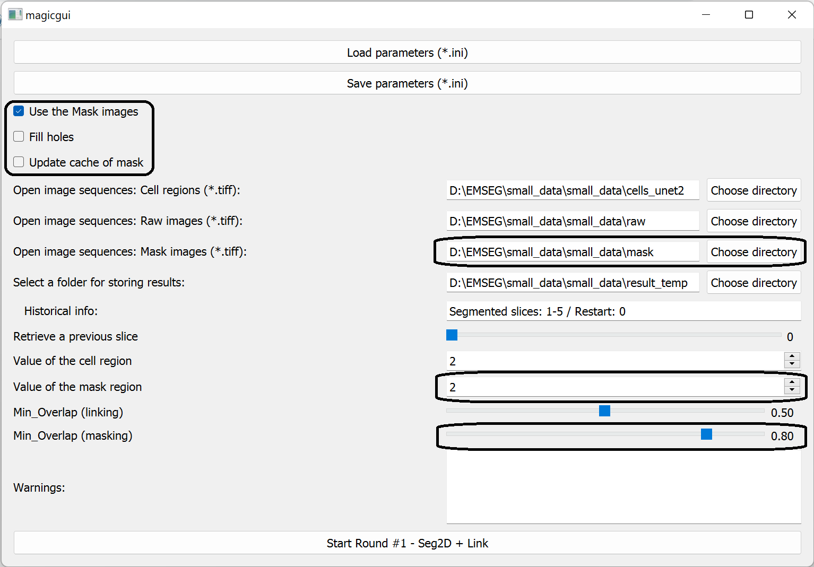

## Specify images/parameters in Seg2D+Link

### Parameter panels

### 1. Paths of images/results
- Users should specify three folders:
    1. containing the cell/non-cell prediction images (2D Tiff images);
    2. containing the raw images (2D Tiff images);
    3. to store the segmentation results.

### 2. Parameters
- Users should specify following parameters:
    1. Slice number to be retrieved. 
        - Default value is the last slice that have been segmented.
        - The segmentation results after the specified slice number will be deleted.
        - If set it to 0, the program will restart the segmentation and remove all previous segmentation results.
    2. Value of the cell region.
        - Set it according to the cell/non-cell images.
    3. The minimal overlap coefficient.
        - This is a custom threshold used for linking cells across slices.
        - Supposing there are two cells X and Y in two adjacent slices, their overlap coefficient is:
               $$overlap(X,Y)=\frac{Area(X\cap Y)}{min(Area(X),Area(Y))} $$
        - If $overlap(X, Y) > threshold$, cells X and Y will be linked.

### 3. Save/Load the paths/parameters
- Users can save the specified parameters in a .ini file and reload it later to avoid having to set the paths/parameters every time the software is launched.
- Users can modify other advanced parameters (e.g. the maximal number of steps of cached actions) in the saved .ini files ([Explanations](../advanced_parameters.md)).

### 4. Use Mask images
This option allows users to segment cells in regions of interest (ROI) defined by users.
When it is selected, the GUI will change as follows:

Users should further specify following parameters:

1. Fill holes.
    - Force the program to automatically fill the holes in the user-defined ROI. The calculation will take a long time when processing large image (but only once).
2. Update cache of mask.
    - The cache is a .npy file of the original/holes-filled mask image. It was created to avoid repeated calculations after launching the software.
    - Check this option will force the program to re-make the cache file, which will take a long time.
    - If it is not checked, the program will try to load the mask data from the existed cache file.
3. Path for mask images.
    - Specify the folder containing the mask images (2D Tiff images);
4. Value of the mask region.
    - Set this to the value of the user-defined ROI in mask images.
5. The minimal overlap.
    - This is a custom threshold for ignoring cells outside of the ROI..
    - Assuming a cell A was partially located within the ROI, then the overlap of A within ROI is:
          $$overlap(A)=\frac{Area(X\cap ROI)}{Area(A)} $$
    - If $overlap(A) < threshold$, Cell A will be removed from the segmentation result.

### 5. Warning information
If the images or specified folders are not found, the warning information will be displayed here.

### 6. Start the Seg2D+Link Module
Press this button to launch the Seg2D+Link module.