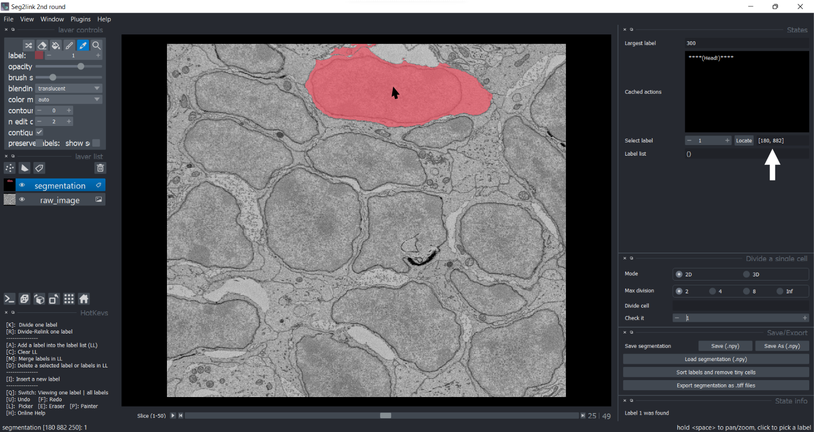

### Locate a cell

The localization function very useful when the cells have been sorted according to their importance (size). In such condition, users can selectively inspect
and correct these more important cells.

The segmentation shown below has been processed with [sort + remove tiny cells](./sort_remove.md#remove-tiny-cells).

1. Select the cell whose label = 1 (the largest cell). Press the button **Locate**.

    

    *The view jumps to the slice containing the cell center*

2. Press **Q** to view the selected label and hide other labels.

    

    - *The [x, y] coordinates of the cell center can be found after the ***Locate*** button.*
    - *The [x, y, z] coordinates of the cursor can be found at left-bottom.*
    - *This coordinates information can help users to find a tiny cell that is hard to see.*

3. You can locate another cell by modifying the **Select label** and pressing **Locate** again.

    

    *Cell 2 is found*

4. To view all cells, press **Q** again.

    