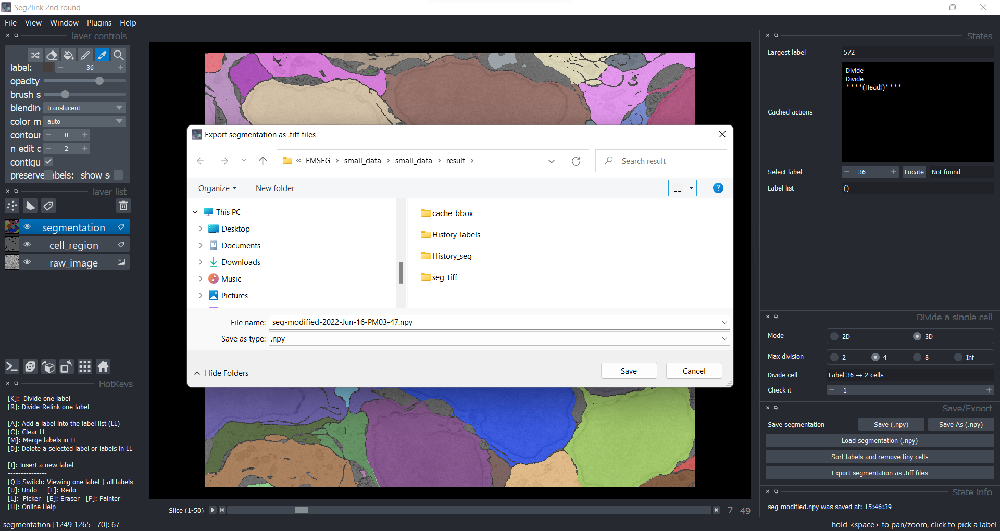
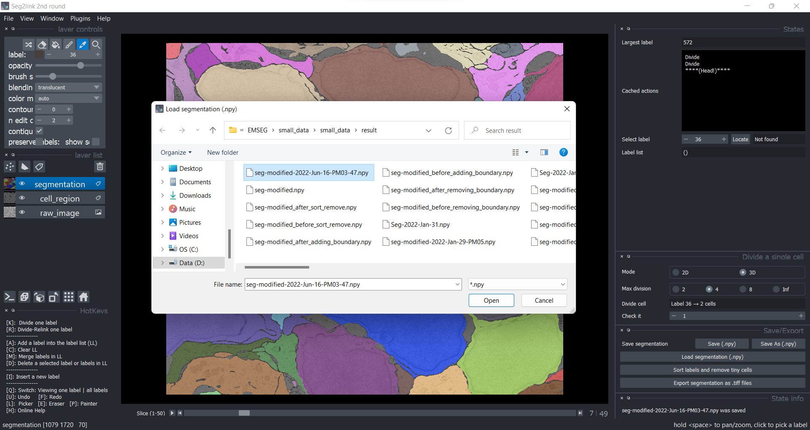
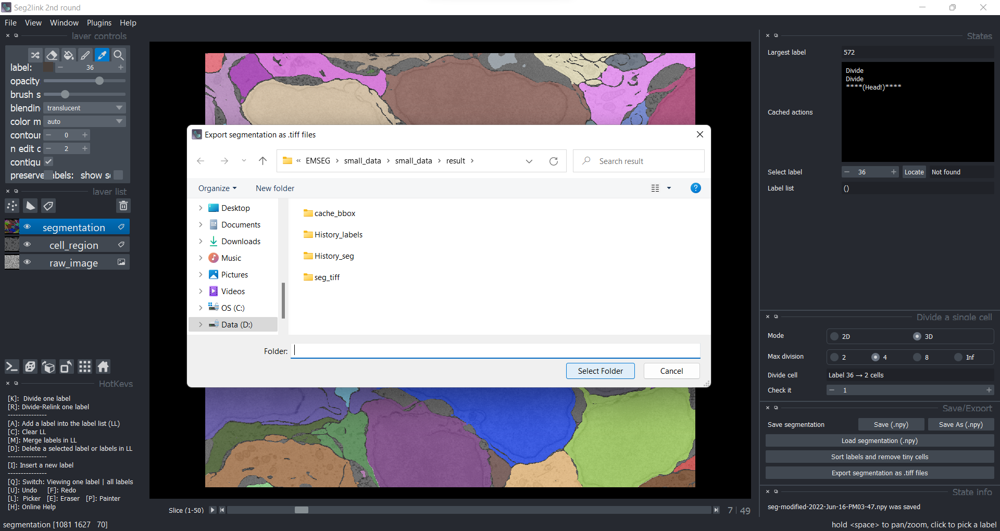

### Save/Load/Export

#### Save and Load
Because saving the intermediate result is time-consuming in 3D correction, the program does not save it automatically. 
Instead, users must manually save the intermediate results after a certain amount of correction is completed.

##### 1. Save
When you have finished a certain number of corrections in the 3D correction module, press the ***Save*** button. 
The program will save the current result as "seg-modified.npy." The old file will be overwritten.

##### 2. Save as
When you need to save the segmentation results into a different file to avoid overwriting an old file, click the ***Save as*** button

##### 3. Load
When you need to load a segmentation result saved previously, click the ***Load segmentation*** button, choose the file you need, and then click the *open* button.

#### Export
To export the result, click the ***Export*** button and then click *Select Folder*. The program will create a sub-folder called "seg-tiff" in which the exported 2D TIFF images will be saved.

- *We recommend saving the exported results to the default folder to avoid confusion*

