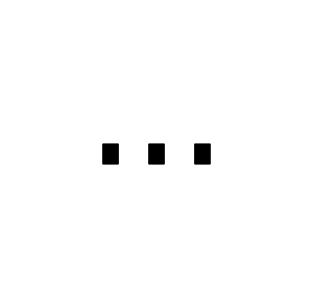
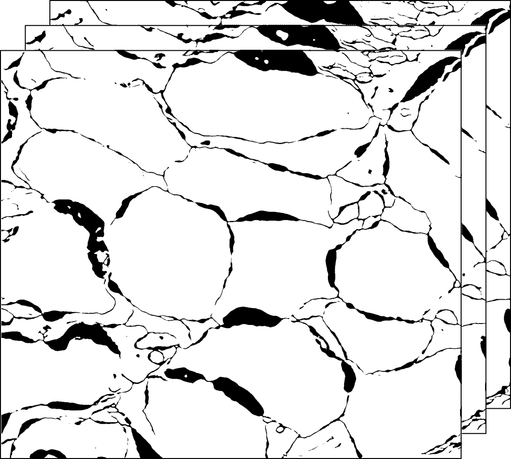

## Segment cells with Seg2Link and Deep learning

### Problem
Assume you have a 3D EM image dataset like this:

{: style="width:350px"}

It is possible to manually annotate the cells in one or more slices one by one. However, when there are thousands of slices, manual annotation becomes impractical.

Modern machine learning and deep learning methods could produce automatic segmentation, but the results could contain a large number of errors that must be corrected manually.

### Solution
By using Seg2Link, you can quickly convert inaccurate deep learning or machine learning predictions to accurate segmentation results.

1. Annotate a few subregions as cell/non cell manually:

    {: style="width:103px"} {: style="width:103px"} {: style="width:103px"}

    *Typically, 20-30 subregions may be sufficient.*

2. With the annotated data, [train a deep neural network](https://github.com/WenChentao/seg2link_unet2d) or other machine learning models.
3. Predict the cell/non-cell regions in the entire 3D image using the trained network:

    {: style="width:350px"}

4. Input your prediction into Seg2Link. It will generate segmentations automatically and allow you to easily correct any errors:

    
