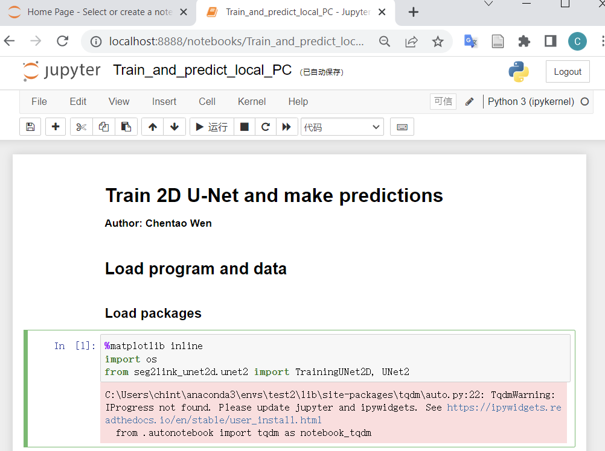
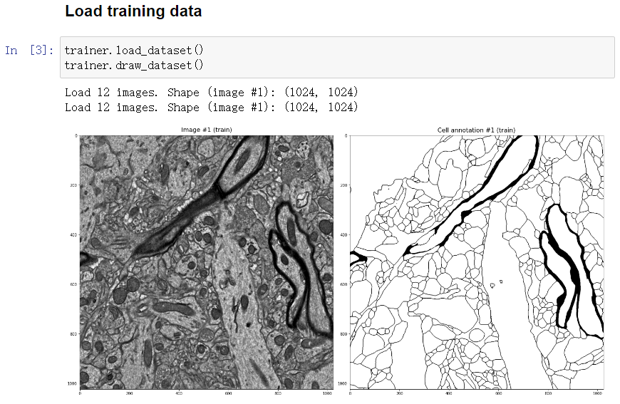
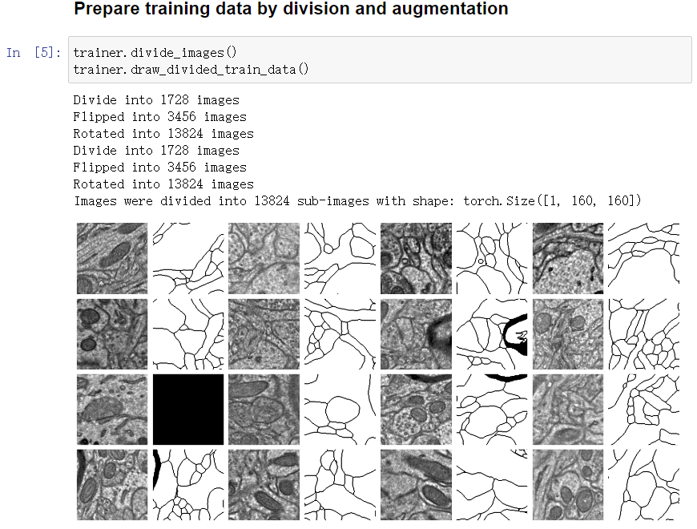
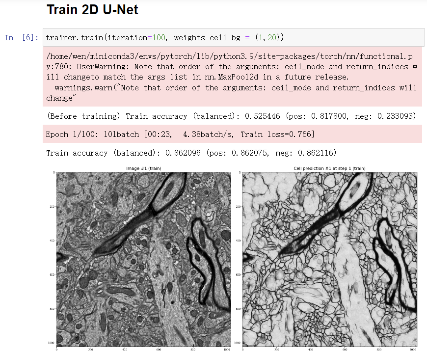
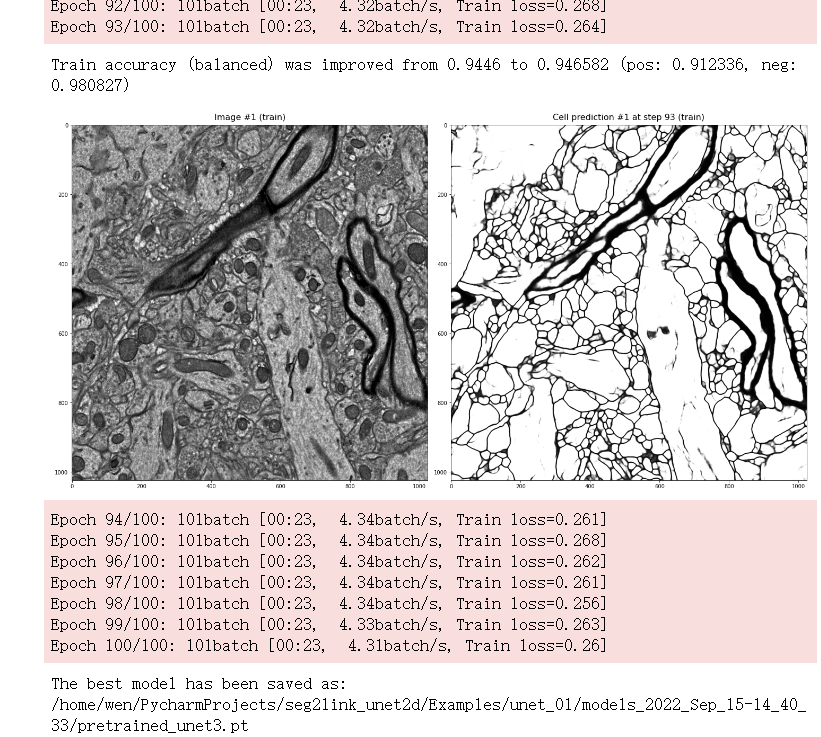
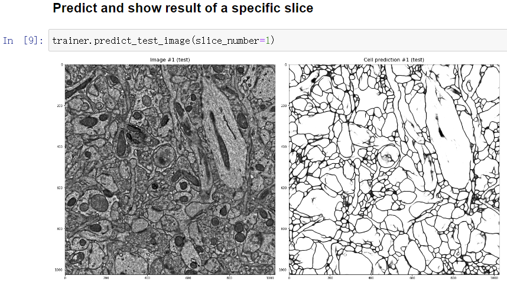

## Prepare cell/non-cell predictions for Seg2Link

We will show you how to predict cell/non-cell using free software/programs. However, you can also perform these tasks using other commercial or free software.

### 1. Prepare raw images

{: style="width:350px"}

You should prepare an image stack saved as 2D images of tiff format.
Please note that currently our training program only supports ***grayscale*** image.

Download a [demo dataset](https://osf.io/wngty/).

### 2. Annotate cells
Here we describe the annotations with [Fiji](https://imagej.net/software/fiji/), 
but you can use any other tools you prefer for the annotation.

1. Drag and drop one slice of the raw image into Fiji.

    {: style="width:350px"}

2. You can select a small subregion and crop it (We don't do it here):

3. Save the 2D image as *train_image0000.tif*, under the directory *train_image*

    {: style="width:350px"}

4. Double-click the paintbrush tool, and check the *Paint on overlay*

    {: style="width:350px"}

5. Paint the non-cell regions

    {: style="width:350px"}

6. After the painting is done, create a mask image from the overlay:

    {: style="width:350px"}  
    
    {: style="width:300px"}

7. Invert the mask image so that non-cell regions have a value of 0:
   
    {: style="width:350px"}  
    
    {: style="width:300px"}

8. Save the mask image as *train_cells0000.tif*, under the directory *train_label*

9. Repeat above procedures to make 20 or more annotations.

### 3. Install the deep learning environment in local PC
    
If you have a CUDA-enabled GPU, you can install the deep learning environment on your ***local PC***. If not, you can skip this step and use the free GPU resource and deep learning environment in ***Google Colab***.

- Install [Anaconda](https://www.anaconda.com/products/individual) 
  or [Miniconda](https://conda.io/miniconda.html)
- Launch the Anaconda PowerShell Prompt in Windows or the terminal in macOS/Linux. Create a new conda environment with a custom name, such as unet2d, and activate it by running following commands:
```console
$ conda create -n unet2d
$ conda activate unet2d
```
- Install [Pytorch](https://pytorch.org/) in the unet2d environment
- Install seg2Link-unet2d in the unet2d environment:
```console
(unet2d) $ pip install seg2Link-unet2d[local]
```

### 4. Launch the notebook for training
Please select one of the two methods listed below based on the environment you are working in.

#### 1) Launch the notebook in your local PC
- Right click to download the notebook ([link](https://github.com/WenChentao/seg2link_unet2d/raw/master/Examples/Train_and_predict_local.ipynb))
    - If the file is saved with .txt extension, change it to .ipynb.
- Move to the directory containing the notebook. (replace C:/xxx/xxx/ with the real path)
```console
(unet2d) $ cd C:/xxx/xxx/
```
- Place your raw images and training data into a directory with a custom name such as *unet_01*. 
  The directory *unet_01* should be placed in the same parent directory as the training notebook:
```
C:/xxx/xxx
    ├───Training_notebook_xxx.ipynb
    └───unet_01
        ├───raw_image
        │       ├───raw_image0000.tif
        │       ├───raw_image0001.tif
        │       ├───raw_image0002.tif
        │       └───...
        ├───train_image
        │       ├───train_image0000.tif
        │       ├───train_image0001.tif
        │       ├───train_image0002.tif
        │       └───...
        └───train_label
                ├───train_cells0000.tif
                ├───train_cells0001.tif
                ├───train_cells0002.tif
                └───...    
```
- Launch the jupyter notebook

```console
(unet2d) $ jupyter notebook
```
{: style="width:450px"}  

- Open the notebook and proceed to step 5 below for training.

#### 2) Launch the notebook in Google Colab
- Right click to download the notebook ([link](https://github.com/WenChentao/seg2link_unet2d/raw/master/Examples/Train_and_predict_Google_Colab.ipynb))
    - If the file is saved with .txt extension, change it to .ipynb.
- Launch [Google Colab](https://research.google.com/colaboratory/) and upload the downloaded notebook
- Enable GPUs in Google Colab:
    - Navigate to Edit → Notebook Settings
    - Select GPU from the Hardware Accelerator drop-down
- Place your raw images and training data into a directory with a custom name such as *unet_01*. 
  Upload *unet_01* to the root of your Google drive:
```
root of your Google drive
    └───unet_01
        ├───raw_image
        │       ├───raw_image0000.tif
        │       ├───raw_image0001.tif
        │       ├───raw_image0002.tif
        │       └───...
        ├───train_image
        │       ├───train_image0000.tif
        │       ├───train_image0001.tif
        │       ├───train_image0002.tif
        │       └───...
        └───train_label
                ├───train_cells0000.tif
                ├───train_cells0001.tif
                ├───train_cells0002.tif
                └───...    
```
- Install seg2link-unet2d.

    

- Mount your Google drive.
    - You'll be asked to give Google Colab permission to access your Google Drive.
    
        

- Proceed to step 5 below for training.

### 5. Train 2D U-Net
The steps in 5 and 6 apply to both local PCs and Google Colab.

- Run the code (Shift+Enter) to load packages.

    {: style="width:450px"}  

    *If no error occurs (warnings can be ignored), the seg2link-unet2d has been installed correctly.*

- Initialize the trainer

    {: style="width:450px"}  

- Load the training data

    {: style="width:450px"}  

- Normalize the training data

    {: style="width:450px"}  

- Divide images into subregions and apply augmentation

    {: style="width:450px"}  

- Start training
    - By default, you will apply 100 iterations x 1 times of training. But you can change the parameter *iteration* and apply more or less times of training.
    - Everytime the accuracy is improved, the model will be saved, and the prediction will be updated and displayed.
    - You can force the U-Net to improve its accuracy in cell regions or non-cell regions by modifying the weights_cell_bg parameter.
    - *Results (Epochs 1)*
  
        {: style="width:450px"}  
  
    - *Results (Epochs 92-100)*
  
        {: style="width:450px"}  
  
### 6. Predict cell regions
- Load the model that was saved during training. You must replace the *models_xxx* in the path with the directory created when initializing the trainer.
    - By default, the best model with the highest accuracy (*pretrained_unet3.pt*) will be loaded.
  
    {: style="width:450px"}  

    - But you can also choose a different model exist in the *models_xxx* directory (such like *weights_training_epoch20.pt*).

- Calculate and display the prediction in a specified slice.
  
    {: style="width:450px"}  

- If you are satisfied with the prediction, predict in all slices. The predictions will be saved into the directory *raw_label* under *unet_01*
  
    {: style="width:450px"}  

